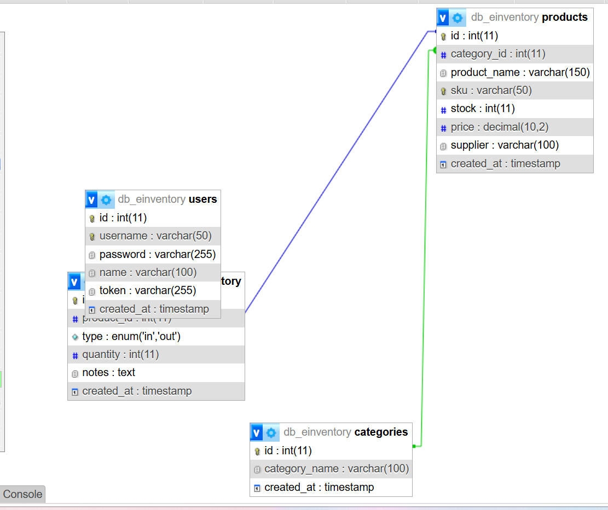
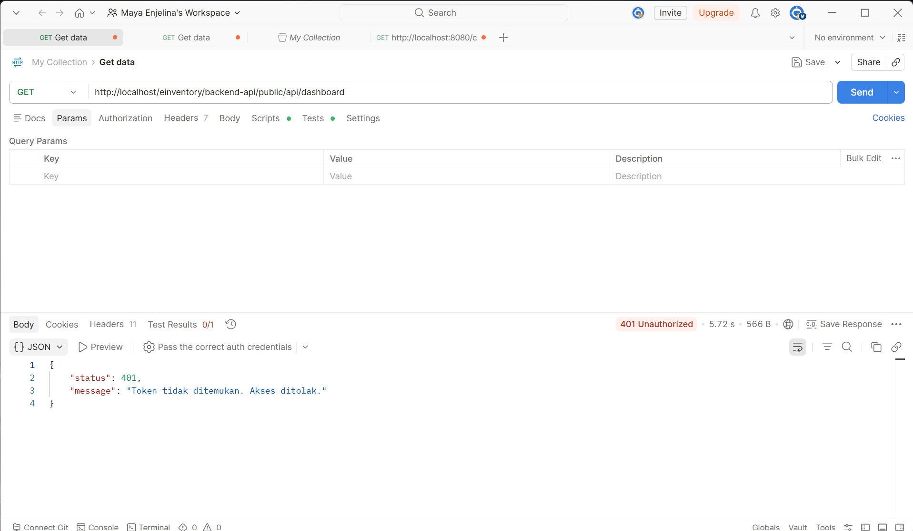
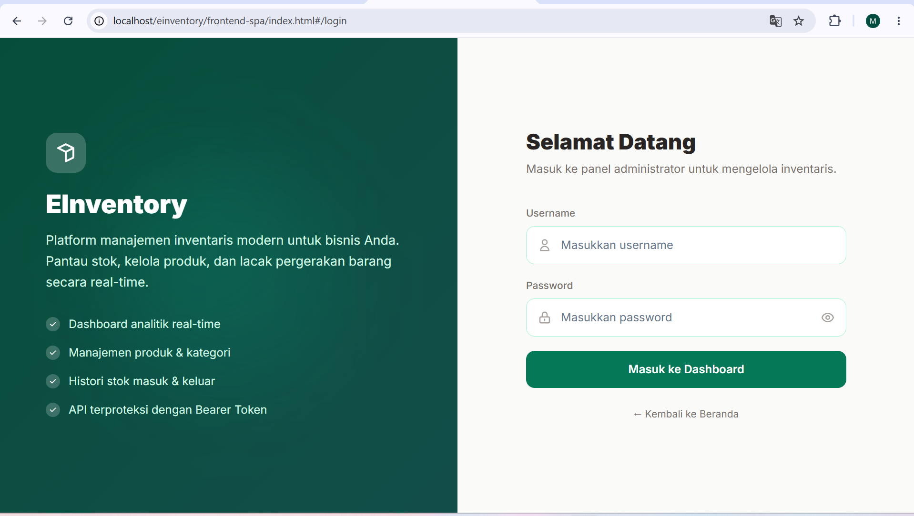
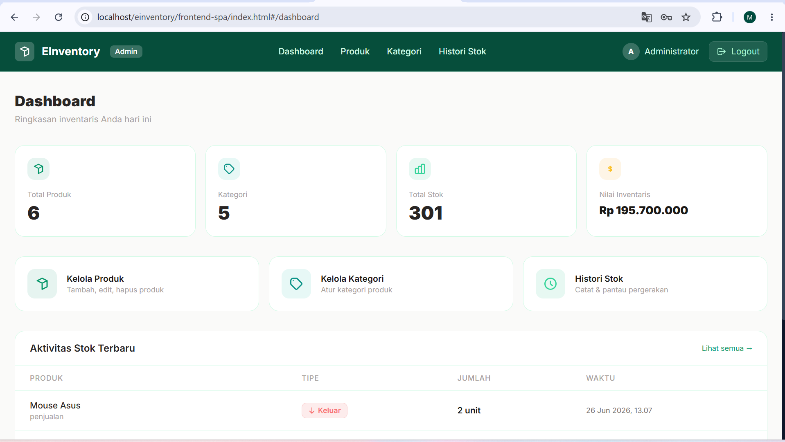
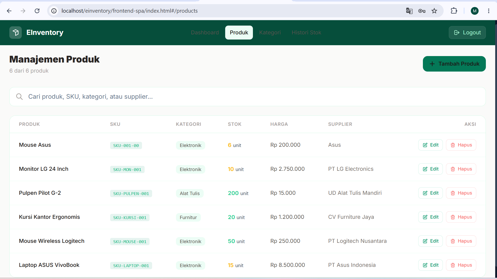
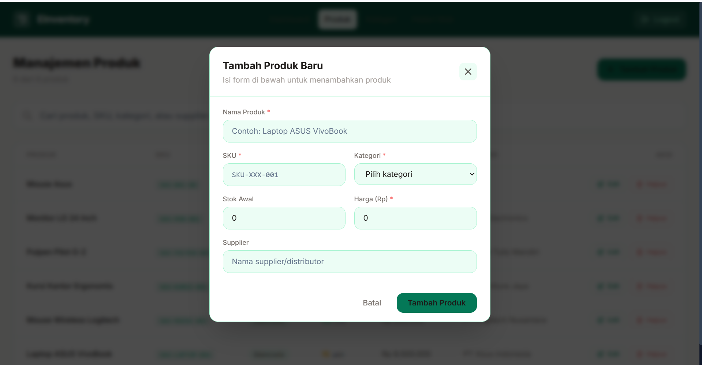
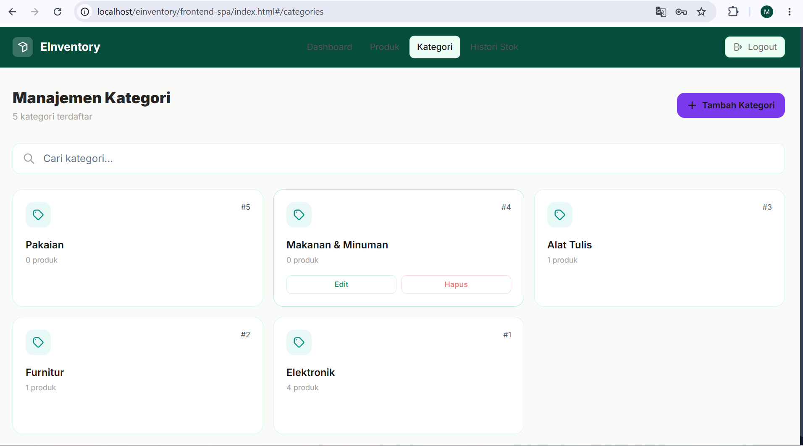
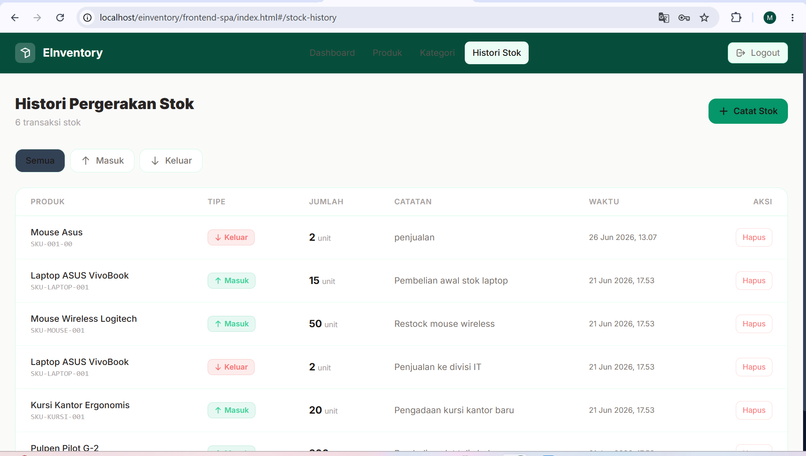

# 📦 E-Inventory System

## Deskripsi Proyek

**E-Inventory System** adalah aplikasi manajemen inventaris berbasis web yang dibangun untuk membantu bisnis memantau stok barang, mengelola data produk & kategori, serta melacak histori pergerakan stok (barang masuk/keluar) secara real-time.

Studi kasus yang dipilih adalah **sistem inventaris gudang/toko**, di mana terdapat dua jenis pengguna dengan hak akses berbeda:
- **Pengunjung (Public)** — dapat melihat ringkasan statistik inventaris tanpa perlu login.
- **Administrator** — dapat login untuk mengelola seluruh data master (produk, kategori, histori stok) melalui dashboard.

Proyek ini dibangun dengan arsitektur **terpisah antara Backend (REST API) dan Frontend (SPA)**:

| Bagian | Teknologi |
|---|---|
| Backend API | CodeIgniter 4 (PHP) |
| Autentikasi API | Bearer Token |
| Frontend | Vue 3 (CDN) + Vue Router |
| Styling | Tailwind CSS |
| Database | MySQL |
| HTTP Client | Axios |

---

## 🗂️ Hak Akses Pengguna (User Matrix)

| Role | Akses |
|---|---|
| **Pengunjung / Public** (tanpa login) | Hanya dapat melihat halaman **Beranda** (ringkasan total produk, kategori, stok, dan nilai inventaris) |
| **Administrator** (wajib login) | Dapat mengakses **Dashboard**, melakukan **tambah/edit/hapus** data master (produk, kategori, histori stok), dan **logout** |

---

## 🗄️ Skema Relasi Database
Skema Relasi Database

```

```

**Struktur tabel:**
- `users` (id, username, password, name, token, created_at)
- `categories` (id, name, ...)
- `products` (id, name, category_id, sku, stock, price, ...)
- `stock_history` (id, product_id, type, quantity, notes, created_at)

---

## 🔒 Uji Coba Proteksi API (Postman)



---

## 🖥️ Tampilan Antarmuka Aplikasi

### 1. Halaman Login

> 📸 **[Lampirkan screenshot halaman `/login` di sini]**
```

```

### 2. Halaman Dashboard Admin

> 📸 **[Lampirkan screenshot halaman `/dashboard` setelah login di sini]**
```

```

### 3. Form Modal Tambah/Edit Data

> 📸 **[Lampirkan screenshot manajemen produk dan tambah produk]**
```


```

### 4. Visualisasi Data Tabel (TailwindCSS)

> 📸 **[Lampirkan screenshot manajemen kategori, dan Histori Stok]**
```



```

---

## ⚙️ Petunjuk Instalasi & Menjalankan Proyek (Lokal)

### Persyaratan
- [XAMPP](https://www.apachefriends.org/) (PHP ≥ 8.2, MySQL/MariaDB, Apache)
- [Composer](https://getcomposer.org/)
- Browser modern (Chrome/Edge/Firefox)

### 1. Clone / Extract Proyek
Letakkan folder proyek di dalam direktori `htdocs` XAMPP, contoh:
```
D:\xampp\htdocs\einventory\
├── backend-api/
└── frontend-spa/
```

### 2. Setup Database
1. Jalankan XAMPP, aktifkan **Apache** dan **MySQL**.
2. Buka `http://localhost/phpmyadmin`, buat database baru bernama `db_einventory`.
3. Import struktur tabel (`users`, `categories`, `products`, `stock_history`) — bisa lewat file `.sql` proyek (jika ada) atau buat manual sesuai struktur di atas.
4. Tambahkan akun admin default:
   ```sql
   INSERT INTO users (name, username, password, created_at)
   VALUES ('Administrator', 'admin', 'admin123', NOW());
   ```

### 3. Setup Backend (CodeIgniter 4)
```bash
cd D:\xampp\htdocs\einventory\backend-api
composer install
```
Pastikan file `.env` sudah berisi konfigurasi database yang sesuai:
```
database.default.hostname = localhost
database.default.database = db_einventory
database.default.username = root
database.default.password =
database.default.DBDriver = MySQLi
```

Uji backend dengan membuka:
```
http://localhost/einventory/backend-api/public/api/public/summary
```
Jika muncul response JSON, backend sudah berjalan dengan baik.

### 4. Jalankan Frontend
Frontend bersifat statis (Vue 3 via CDN), tidak perlu build/install. Cukup buka langsung melalui Apache:
```
http://localhost/einventory/frontend-spa/index.html
```

### 5. Login sebagai Admin
- **Username:** `admin`
- **Password:** `admin123`

---

## 🔗 Link Demo & Presentasi

| Jenis | Link |
|---|---|
| 🌐 Demo Aplikasi | `[Tempel link demo di sini, misal Netlify/hosting/ngrok]` |
| 🎥 Video Presentasi | `[Tempel link video presentasi di sini, misal YouTube/Google Drive]` |

---

## 👤 Penyusun

- Nama: `[Maya Enjelina]`
- NIM: `[312410378]`
- Mata Kuliah: `[Pemrograman web 2]`
